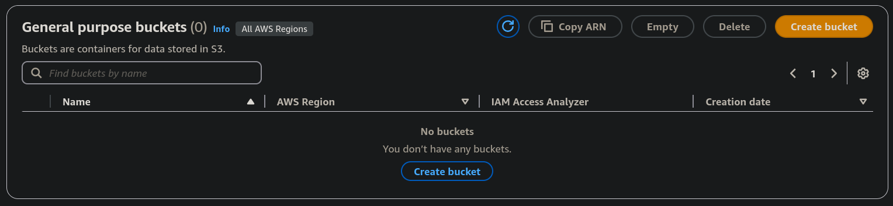
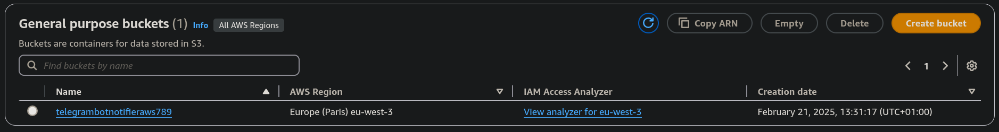
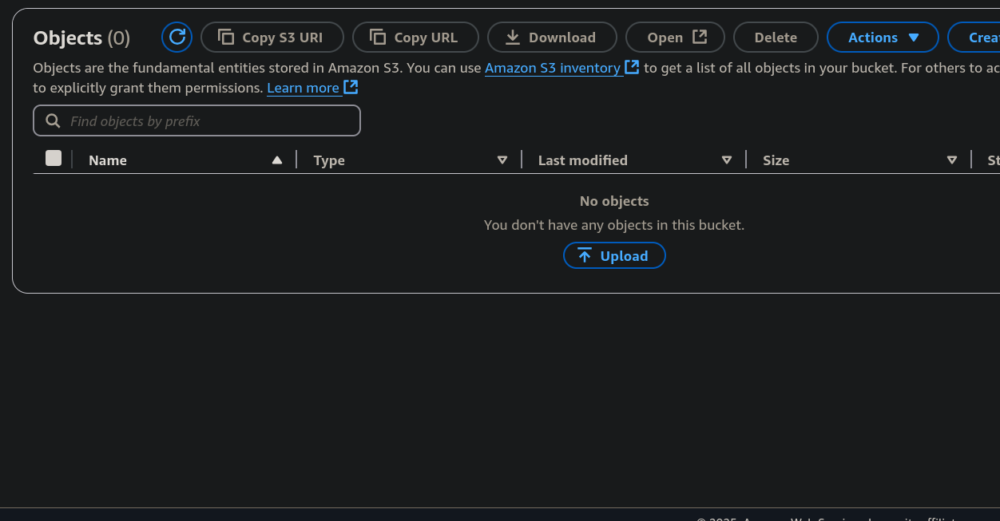
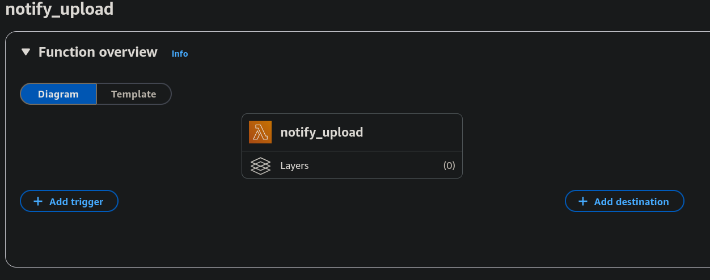
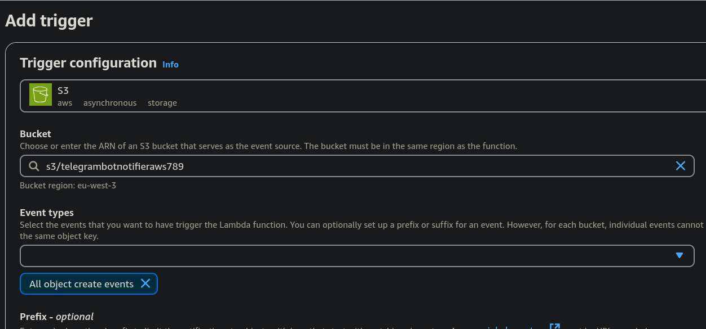
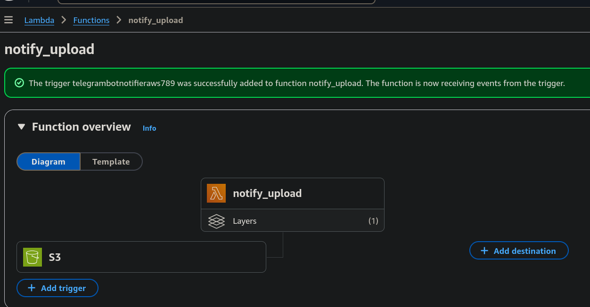
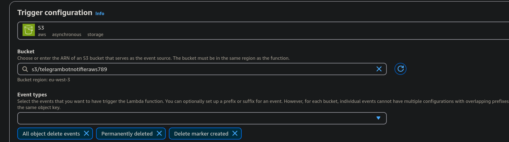
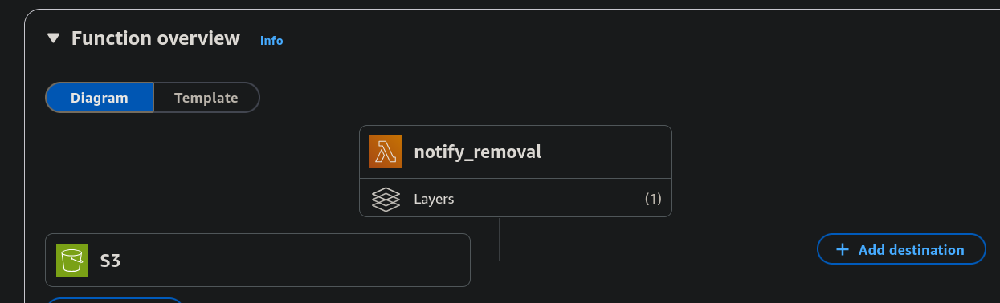
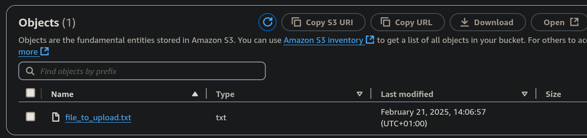
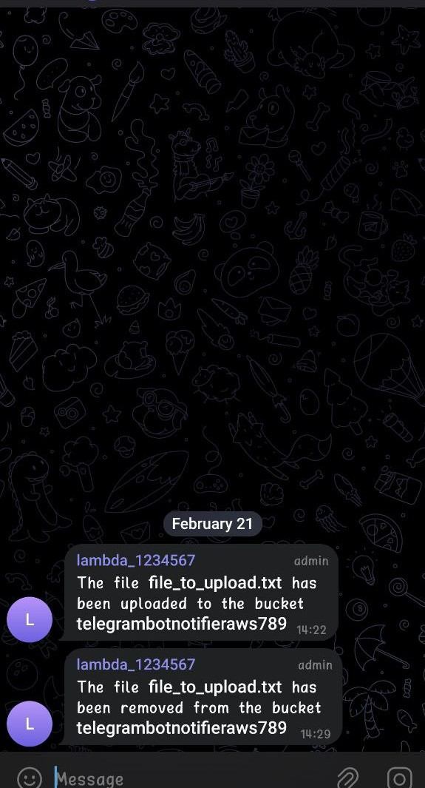

# Telegram Bot file upload/delete notifier using AWS S3 and AWS Lambda

In this repo, I am going to explain how to implement a Telegram Bot notifier that connects with a S3 Bucket to send a message in case a file is uploaded or removed to that bucket.

In this ocassion, we want to leverage the power of using S3 and Lambda together. Particularly, AWS has an easy way to configure S3 events as triggers for Lambda functions. That is basically what we can see in the Figure below, that describes the overall architecture of the application.

</img>

## Step 1: Create the bot and add it to a group

I have already explained in detail how to create a bot in <a href="https://github.com/Dani-97/clip_imagesearch_aws_telegram_bot/tree/main">this repo</a>. Apart from that, creating a bot is something super easy and there are many tutorials in the web you can follow to do it!

Now, what I want to clarify is that, to simplify the process, I have decided to add the bot to a group. If you do not understand why I am saying "simplify" let me explain. When you want to implement a Telegram bot, you need to know to which chat you must send the message. 

This can be a bit difficult to find if, for example, you Telegram user does not have a public username. Then, instead of spending some time figuring out how to do that, I decided to create a group and make it public so the ID of the chat is much easier to find (given that, at the end, making this application more or less secure is out of scope for what I am just trying to do).

These are the steps to follow:

- Create a bot.

- Create a group.

- Add the bot to the group.

- Give the bot the administrator role (or, at least, the bot must have permissions to send messages, very important).

- Make the group public. We could work with a private group, but, once again, this makes it a bit more difficult. If you want to do something like this without making anything public, you will need to figure out how.

## Step 2: Create the S3 bucket

Now, let's go to one of the most important parts: create the S3 bucket. In this case, creating a general purpose bucket will be more than sufficient because we are not going to do very big things. For that, we need to go to the S3 Service in AWS Console and we will find something like what we have in the Figure below (if you have not created any bucket).

</img>

After creation it should look like this:

</img>

And the S3, of course, will be empty:

</img>

You can already prepare the mock file that you are going to upload. It can be whatever you want. In my case, I created a plain text file saying something like "This is a test". Do not overcomplicate yourself at this step. You just need a small file.

## Step 3: Create the Lambda functions and link them to the S3 bucket

Once the S3 bucket has been created, we can go to the AWS Lambda service. I already explained how to create Lambda functions in <a href="https://github.com/Dani-97/clip_imagesearch_aws_telegram_bot/tree/main">here</a>. Firstly, we need to create <code>notify_upload</code> (well, this is not compulsory. Start from the one you prefer).

</img>

In the same way as I explained in the repo that I already linked twice before, we need to add a trigger and a layer. The trigger is the most interesting aspect in this project, because there is where we will use the S3 bucket events. Then, the layer is what is going to contain the dependencies to execute the Python code. I am not going to explain how to create and add a layer, so let's go right to the trigger part.

Add a S3 Bucket trigger is very simple. We go to <code>Add trigger</code>, and we select the object creation events as the trigger (linking the Lambda function with the desired S3 Bucket).

</img>

After that, the Lambda function should look like this:

</img>

As you can see, now the function has one layer and a S3 event as trigger.

For the other Lambda function <code>notify_removal</code>, we will repeat the exact same process. In this case, the process should look like this:

</img>

</img>

> I want to clarify one point. If we think about it, we do not really need two Lambda functions, one for object creation notification and another one for object removal notification. Instead, we could code a single Lambda function that checks the type of the event that has been triggered. Nevertheless, I found it very interesting to do it this way, because it shows how modular this can be. Probably not for this ocassion, but in a more complex project, it may be necessary to allow some events to be received by a certain group of users while denying others. I think that, doing it in this way, the management of things like permissions would be much safer and easier.

## Step 4: Code the Lambda functions

Finally, we are going to code the Lambda functions to do what we want them to do. Once again, as I did <a href="https://github.com/Dani-97/clip_imagesearch_aws_telegram_bot/tree/main">in this repo</a>, we can start debugging things locally if we wish, and then uploading the files to the AWS Console. As it is always recommended, start with the first Lambda function you wish and do something simple. In my case, I made the bot to answer "Test" when a file was uploaded to the S3 Bucket.

</img>

After a process of coding and refinement, I came up with what you can find <a href="https://github.com/Dani-97/telegram_bot_aws_s3_notification/tree/main/lambda_functions">in this link</a>. If everything is correct, you will upload a file in the S3 Bucket like this:

</img>

And get a message by the bot like this:

</img>

After configuring both Lambda functions, your group chat should look like this:

</img>

The speed of the answers is very good! A few seconds after uploading or deleting an object to/from the S3 Bucket, you should receive the message.

