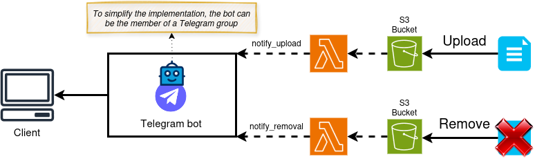

# Telegram Bot file upload/delete notifier using AWS S3 and AWS Lambda

In this repo, I am going to explain how to implement a Telegram Bot notifier that connects with a S3 Bucket to send a message in case a file is uploaded or removed to that bucket.

In this ocassion, we want to leverage the power of using S3 and Lambda together. Particularly, AWS has an easy way to configure S3 events as triggers for Lambda functions. That is basically what we can see in the Figure below, that describes the overall architecture of the application.

</img>

## Step 1: Create the bot and add it to a group

These are the steps that must be followed when creating the bot.

- Create a bot.

- Create a group.

- Add the bot to the group.

- Give the bot the administrator role.

- Make the group public? Or is it ok to implement this with a private group?

As the library <code>telebot</code> works, it is necessary to specify the chat_id of the group. This is much easier to do if the group is public. Of course, if the group is public, we could have a safety problem, but given that this is a small test of S3 and Lambda functionalities, I will not take care about that aspect. However, if you want to do something similar to this in the future, you must be aware that something like this could be a big problem. Surely, there are ways to do it with private groups, but this makes the process a bit more complex and it is out of scope for what I am trying to show here.

## Step 2: Create the S3 bucket

> PENDING

## Step 3: Create and code the Lambda functions

> PENDING

## Step 4: Connect the Lambda functions to the S3 events (using them as triggers)

> PENDING